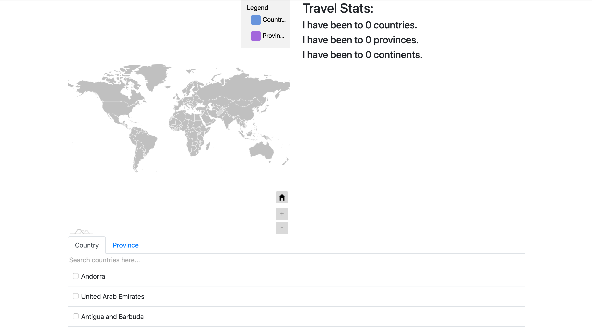

# TravelStats
AmCharts 4

Provides a world map with countries that can be selected through the countries table and a drill-down view to a state/province level with selectable areas through the province table. The statistics for visited countries and provinces are on the right hand side. 

[Live site](http://aprestoes.github.io/Travel-Stats)

# Credits
Based off of and uses some starter code from https://www.amcharts.com/visited_countries/, https://www.amcharts.com/demos/selecting-multiple-areas-map/, and https://www.amcharts.com/demos/drill-down-to-countries/ AmChart 4 demos.

Inspired by https://www.amcharts.com/visited_countries/.

Uses AmCharts 4, jQuery, ~~jsColor~~, and Bootstrap.

Currently a WIP.
